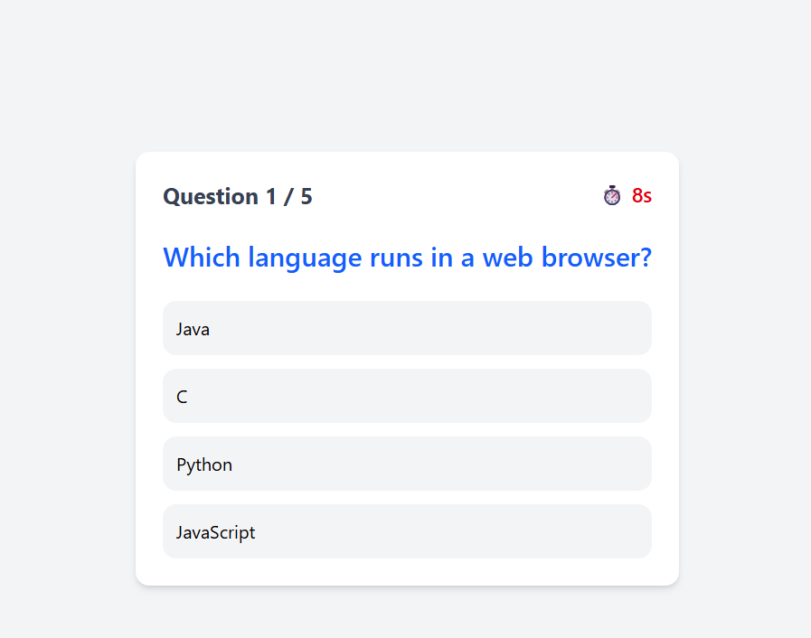
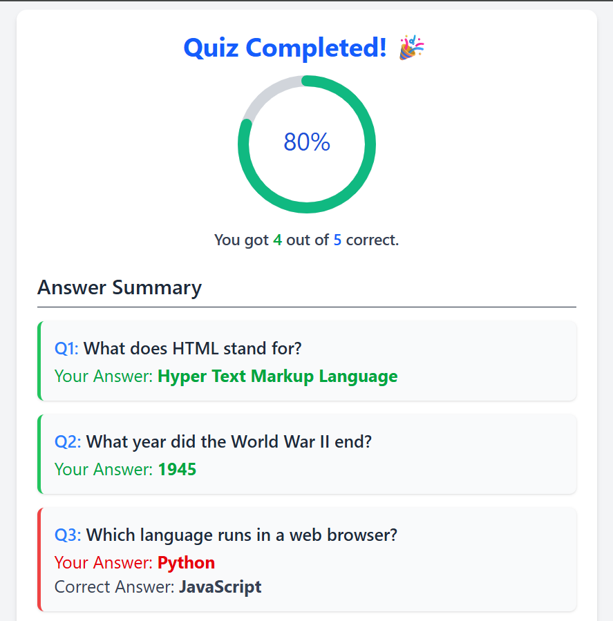

Responsive Quiz App
A simple and responsive quiz web application built using React and Tailwind CSS.
This app displays a set of random questions, tracks user scores, handles question timers, and shows a summary screen upon completion.

Features
Random questions for each quiz session
Per-question timer (auto-moves to next question if time runs out)
Score tracking and result summary at the end
Fully responsive design using Tailwind CSS

Tech Stack
React.js
Tailwind CSS

